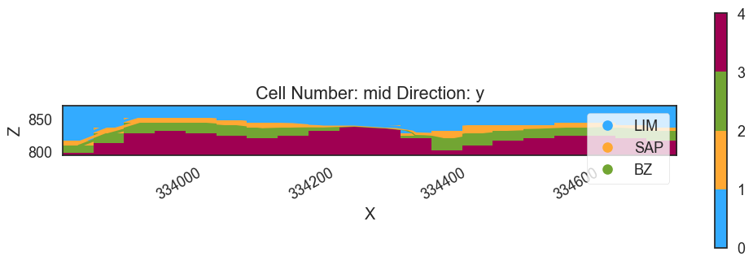
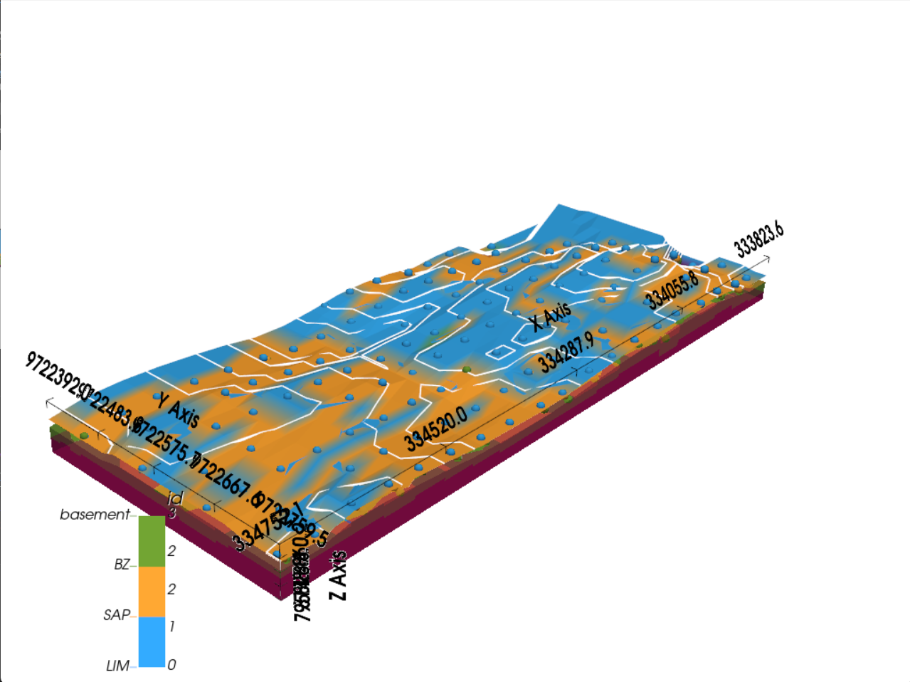

### **Pendahuluan**
Panduan ini disusun menggunakan Python dengan library seperti `pandas`, `numpy`, `gempy`, dan `gempy_viewer` untuk memproses data drill hole (collar, survey, litologi, dan assay) serta membuat model geologi 3D. Data yang digunakan dalam tutorial ini menggunakan data endapan nikel laterit dengan litologi seperti LIM (limonit), SAP (saprolit), dan BZ (batuan dasar). Adapun proses yang dilakukan meliputi penginputan data, desurvey drill hole, pengolahan litologi, pengaturan model geologi, penghitungan, dan visualisasi hasil dalam 2D dan 3D.

---

### **Blok 1: Pengaturan dan Impor library**
```python
# Install library yang diperlukan jika belum terinstall
# pip install pandas numpy pyvista matplotlib gempy gempy_viewer

import os
os.environ["DEFAULT_BACKEND"] = "PYTORCH"

import pandas as pd
import numpy as np
import gempy as gp
import gempy_viewer as gpv
from pyvista import set_plot_theme
set_plot_theme('document')
```
- **Tujuan**: Menyiapkan environment dengan mengimpor library yang diperlukan dan mengatur konfigurasi.
- **Langkah-langkah**:
  - Mengatur variabel environment `DEFAULT_BACKEND` ke `"PYTORCH"` untuk perhitungan GemPy (PyTorch digunakan untuk operasi numerik yang lebih cepat).
  - Mengimpor `pandas` untuk penanganan data, `numpy` untuk operasi numerik, `gempy` untuk pemodelan geologi, dan `gempy_viewer` untuk visualisasi.
  - Mengatur tema plot PyVista ke `'document'` untuk tampilan bersih bergaya publikasi.
- **Output**: Mencetak `"Setting Backend To: AvailableBackends.PYTORCH"`.

---

### **Blok 2: Memuat dan Menampilkan Data**
```python
# Memuat data Anda
collar = pd.read_csv('collar.csv')  # hole_id, y, x, z
survey = pd.read_csv('survey.csv')  # hole_id, dip, azimuth, depth
lithology = pd.read_csv('lithology.csv')  # hole_id, from_depth, to_depth, lithology
assay = pd.read_csv('assay.csv')  # hole_id, from_depth, to_depth, nickel_grade

print(collar.head(), survey.head(), lithology.head(), assay.head())
```
- **Tujuan**: Memuat data drill hole dari file CSV dan menampilkan lima baris pertama dari setiap dataset.
- **Langkah-langkah**:
  - Memuat empat dataset:
    - `collar`: Lokasi collar drill hole (BHID, XCOLLAR, YCOLLAR, ZCOLLAR).
    - `survey`: Data survei drill hole (BHID, DEPTH, AZIMUTH, DIP).
    - `lithology`: Interval litologi (BHID, Fr., To, LITOLOGI).
    - `assay`: Data assay dengan kadar nikel (BHID, Fr., To, Total Ni, dll.).
  - Menggunakan `head()` dari `pandas` untuk melihat pratinjau data.
- **Output**: Menampilkan contoh baris dari setiap DataFrame, menunjukkan ID drill hole, koordinat, kedalaman, kemiringan, azimuth, litologi (misalnya LIM), dan nilai assay (misalnya kadar nikel).

---

### **Blok 3: Mengganti Nama Kolom**
```python
collar = collar.rename(columns={'BHID': 'hole_id', 'YCOLLAR': 'y', 'XCOLLAR': 'x', 'ZCOLLAR': 'z'})
survey = survey.rename(columns={'BHID': 'hole_id', 'DIP ': 'dip', 'AZIMUTH': 'azimuth', 'DEPTH': 'depth'})
lithology = lithology.rename(columns={'BHID': 'hole_id', 'Fr.': 'from_depth', 'To': 'to_depth', 'LITOLOGI': 'lithology'})
assay = assay.rename(columns={'BHID': 'hole_id', 'Fr.': 'from_depth', 'To': 'to_depth', 'Total Ni': 'nickel_grade'})

print(collar.head(), survey.head(), lithology.head(), assay.head())
```
- **Tujuan**: Menstandarkan nama kolom untuk konsistensi dan kompatibilitas dengan GemPy.
- **Langkah-langkah**:
  - Mengganti nama kolom di setiap DataFrame menjadi nama yang konsisten dan deskriptif (misalnya, `BHID` → `hole_id`, `XCOLLAR` → `x`).
  - Mencetak DataFrame yang diperbarui untuk memastikan perubahan.
- **Output**: Sama seperti Blok 2, tetapi dengan nama kolom yang diperbarui (misalnya, `hole_id`, `x`, `y`, `z`, dll.).

---

### **Blok 4: Desurvey drill hole**
Blok ini panjang, jadi saya akan membaginya menjadi dua bagian untuk kejelasan.

#### **Bagian 4.1: Mendefinisikan Fungsi Desurvey**
```python
def desurvey(hole_collar, hole_survey, depth_interval=1):
    hole_survey = hole_survey.sort_values('depth')
    depths = hole_survey['depth'].values
    dips = hole_survey['dip'].values
    azimuths = hole_survey['azimuth'].values
    current_x = hole_collar['x'].iloc[0]
    current_y = hole_collar['y'].iloc[0]
    current_z = hole_collar['z'].iloc[0]
    desurveyed_points = []

    for i in range(len(depths)):
        if i == 0:
            start_depth = 0
            end_depth = depths[0]
            start_dip = 0
            start_azimuth = 0
            end_dip = dips[0]
            end_azimuth = azimuths[0]
        else:
            start_depth = depths[i-1]
            end_depth = depths[i]
            start_dip = dips[i-1]
            start_azimuth = azimuths[i-1]
            end_dip = dips[i]
            end_azimuth = azimuths[i]
        
        avg_dip = (start_dip + end_dip) / 2
        avg_azimuth = (start_azimuth + end_azimuth) / 2
        delta_d = end_depth - start_depth
        if delta_d <= 0:
            continue
        dip_rad = np.radians(avg_dip)
        azimuth_rad = np.radians(avg_azimuth)
        delta_z = -delta_d * np.cos(dip_rad)
        delta_x = delta_d * np.sin(dip_rad) * np.cos(azimuth_rad)
        delta_y = delta_d * np.sin(dip_rad) * np.sin(azimuth_rad)
        
        num_points = int(np.ceil(delta_d / depth_interval))
        for j in range(num_points + 1):
            d = start_depth + j * depth_interval
            if d > end_depth:
                d = end_depth
            fraction = (d - start_depth) / delta_d if delta_d > 0 else 0
            x = current_x + fraction * delta_x
            y = current_y + fraction * delta_y
            z = current_z + fraction * delta_z
            desurveyed_points.append({'depth': d, 'x': x, 'y': y, 'z': z})
        current_x += delta_x current_y += delta_y
        current_z += delta_z
    
    return pd.DataFrame(desurveyed_points)
```
- **Tujuan**: Mendefinisikan fungsi untuk menghitung koordinat 3D di sepanjang jalur drill hole berdasarkan data survei (kemiringan, azimuth, kedalaman).
- **Langkah-langkah**:
  - Mengambil `hole_collar` (titik awal) dan `hole_survey` (perubahan kemiringan, azimuth, kedalaman) sebagai masukan.
  - Mengurutkan data survei berdasarkan kedalaman dan mengiterasi melalui segmen-segmen.
  - Untuk setiap segmen:
    - Menghitung rata-rata kemiringan dan azimuth.
    - Mengonversi ke radian dan menghitung offset 3D (`delta_x`, `delta_y`, `delta_z`) menggunakan trigonometri.
    - Menginterpolasi titik pada interval 1 meter (`depth_interval=1`) antara kedalaman awal dan akhir.
  - Mengembalikan DataFrame dengan titik-titik desurvey (`depth`, `x`, `y`, `z`).

#### **Bagian 4.2: Menerapkan Desurvey ke Semua drill hole**
```python
survey_grouped = survey.groupby('hole_id')
desurveyed_dict = {}
for hole_id, hole_survey in survey_grouped:
    hole_collar = collar[collar['hole_id'] == hole_id]
    if hole_collar.empty:
        continue
    desurveyed = desurvey(hole_collar, hole_survey)
    desurveyed['hole_id'] = hole_id
    desurveyed_dict[hole_id] = desurveyed
desurveyed_df = pd.concat(desurveyed_dict.values(), ignore_index=True)
```
- **Tujuan**: Menerapkan fungsi desurvey ke semua drill hole dan menggabungkan hasilnya.
- **Langkah-langkah**:
  - Mengelompokkan data survei berdasarkan `hole_id`.
  - Untuk setiap drill hole:
    - Mengekstrak data collar-nya.
    - Memanggil `desurvey` untuk menghitung titik-titik 3D.
    - Menambahkan `hole_id` ke hasil dan menyimpannya dalam kamus.
  - Menggabungkan semua titik desurvey menjadi satu DataFrame (`desurveyed_df`).
- **Output**: Tidak ada Output langsung; menghasilkan `desurveyed_df` dengan koordinat 3D untuk semua drill hole.

---

### **Blok 5: Memproses Litologi**
Blok ini juga panjang, jadi saya akan membaginya menjadi beberapa bagian.

#### **Bagian 5.1: Mendefinisikan Fungsi pengolahan Litologi**
```python
# Mendefinisikan urutan stratigrafi
strat_order = {'LIM': 0, 'SAP': 1, 'BZ': 2}

def process_lithology(hole_lithology):
    hole_lithology = hole_lithology.sort_values('from_depth')
    processed = []
    current_lith = None
    current_from = None
    current_thickness = 0

    for i, row in hole_lithology.iterrows():
        lith = row['lithology']
        from_depth = row['from_depth']
        to_depth = row['to_depth']
        thickness = to_depth - from_depth

        if current_lith is None:
            current_lith = lith
            current_from = from_depth
            current_thickness = thickness
        elif strat_order.get(lith, 999) < strat_order.get(current_lith, 999):  # Tidak sesuai urutan
            if thickness < current_thickness:
                continue
            else:
                processed.append({'from_depth': current_from, 'to_depth': from_depth, 'lithology': current_lith})
                current_lith = lith
                current_from = from_depth
                current_thickness = thickness
        else:
            if lith == current_lith:
                current_thickness += thickness
            else:
                processed.append({'from_depth': current_from, 'to_depth': from_depth, 'lithology': current_lith})
                current_lith = lith
                current_from = from_depth
                current_thickness = thickness
    
    if current_lith:
        processed.append({'from_depth': current_from, 'to_depth': to_depth, 'lithology': current_lith})
    
    if not any(p['lithology'] == 'Basement' for p in processed):
        last_to = processed[-1]['to_depth']
        processed.append({'from_depth': last_to, 'to_depth': last_to + 1, 'lithology': 'Basement'})
    
    return pd.DataFrame(processed)
```
- **Tujuan**: Memproses interval litologi untuk memastikan urutan stratigrafi dan menggabungkan unit yang sama secara berurutan.
- **Langkah-langkah**:
  - Mendefinisikan `strat_order` (LIM → SAP → BZ).
  - Mengurutkan data litologi berdasarkan kedalaman.
  - Mengiterasi melalui interval:
    - Menggabungkan interval berturut-turut dengan litologi yang sama.
    - Menyelesaikan unit yang tidak sesuai urutan (misalnya SAP di atas LIM) dengan mempertahankan unit yang lebih tebal.
    - Menambahkan lapisan tipis “Basement” di bagian bawah jika tidak ada.
  - Mengembalikan DataFrame dengan interval yang diproses.

#### **Bagian 5.2: Menerapkan pengolahan dan Menyiapkan Titik Permukaan**
```python
# Menerapkan ke semua lubang
lithology_grouped = lithology.groupby('hole_id')
processed_lithology = pd.concat([process_lithology(group) for _, group in lithology_grouped], 
                                keys=lithology_grouped.groups.keys()).reset_index(level=0).rename(columns={'level_0': 'hole_id'})

# Menyiapkan titik permukaan dan mengekstrak bagian atas LIM untuk topografi
surface_points = []
lim_top_points = []  # Untuk topografi
for hole_id, hole_lithology in processed_lithology.groupby('hole_id'):
    if hole_id not in desurveyed_dict:
        continue
    hole_desurveyed = desurveyed_dict[hole_id]
    depth_to_coords = dict(zip(hole_desurveyed['depth'], hole_desurveyed[['x', 'y', 'z']].to_numpy()))
    
    lim_found = False
    for _, row in hole_lithology.iterrows():
        from_depth = row['from_depth']
        from_coords = depth_to_coords.get(from_depth)
        if from_coords is not None:
            surface_points.append({
                'x': from_coords[0],
                'y': from_coords[1],
                'z': from_coords[2],
                'formation': row['lithology']
            })
            # Menangkap bagian atas LIM
            if row['lithology'] == 'LIM' and not lim_found:
                lim_top_points.append({
                    'x': from_coords[0],
                    'y': from_coords[1],
                    'z': from_coords[2]
                })
                lim_found = True  # Hanya mengambil LIM paling atas

points_df = pd.DataFrame(surface_points)
lim_top_df = pd.DataFrame(lim_top_points)
```
- **Tujuan**: Menerapkan pengolahan litologi ke semua drill hole dan menyiapkan titik permukaan untuk pemodelan.
- **Langkah-langkah**:
  - Mengelompokkan litologi berdasarkan `hole_id` dan memproses setiap kelompok.
  - Menggabungkan hasil menjadi `processed_lithology`.
  - Memetakan koordinat desurvey ke kedalaman litologi.
  - Membuat:
    - `surface_points`: Semua batas litologi dengan koordinat 3D.
    - `lim_top_points`: Titik-titik paling atas LIM untuk topografi.
  - Mengonversi ke DataFrame (`points_df`, `lim_top_df`).

---

### **Blok 6: Menginisialisasi Model Geologi**
```python
all_x = points_df['x'].values
all_y = points_df['y'].values
all_z = points_df['z'].values

extent = [
    np.min(all_x) - 5, np.max(all_x) + 5,
    np.min(all_y) - 5, np.max(all_y) + 5,
    np.min(all_z) - 10, np.max(all_z) + 10
]

geo_model = gp.create_geomodel(
    project_name='Nickel_Mine_Model',
    extent=extent,
    resolution=[20, 20, 20],
    structural_frame=gp.data.StructuralFrame.initialize_default_structure()
)

# Mengatur bagian atas LIM sebagai topografi menggunakan set_topography_from_arrays
topography_points = lim_top_df[['x', 'y', 'z']].to_numpy()
gp.set_topography_from_arrays(
    grid=geo_model.grid,
    xyz_vertices=topography_points  # Mengirimkan array penuh (n, 3)
)

print("Grid aktif:", geo_model.grid.active_grids)
```
- **Tujuan**: Mengatur model geologi GemPy dengan luas dan topografi.
- **Langkah-langkah**:
  - Menentukan luas model berdasarkan koordinat minimum/maksimum dengan tambahan ruang.
  - Membuat `geo_model` dengan resolusi grid 20x20x20.
  - Menggunakan bagian atas LIM untuk menentukan topografi.
  - Mencetak grid aktif (misalnya, DENSE, TOPOGRAPHY).
- **Output**: `"Grid aktif: GridTypes.DENSE|TOPOGRAPHY|NONE"`.

---

### **Blok 7: Mendefinisikan Elemen Struktural**
```python
unique_lithologies = ['LIM', 'SAP', 'BZ']  # Menyertakan Basement secara eksplisit
colors = ['#33ABFF', '#FFA833', '#72A533']

elements = []
for i, lith in enumerate(unique_lithologies):
    lith_points = points_df[points_df['formation'] == lith]
    if lith_points.empty:
        continue
    element = gp.data.StructuralElement(
        name=lith,
        color=colors[i],
        surface_points=gp.data.SurfacePointsTable.from_arrays(
            x=lith_points['x'].values,
            y=lith_points['y'].values,
            z=lith_points['z'].values,
            names=lith
        ),
        orientations=gp.data.OrientationsTable.initialize_empty()
    )
    elements.append(element)

geo_model.structural_frame.structural_groups[0].elements = elements
geo_model.structural_frame.structural_groups[0].name = 'Stratigraphic_Series'
```
- **Tujuan**: Menentukan lapisan stratigrafi (LIM, SAP, BZ) untuk model.
- **Langkah-langkah**:
  - Menetapkan warna untuk setiap litologi.
  - Membuat objek `StructuralElement` dengan titik permukaan untuk setiap litologi.
  - Menambahkan elemen ke kerangka struktural model sebagai seri stratigrafi.

---

### **Blok 8: Menambahkan Orientasi**
```python
centroid_x = points_df['x'].mean()
centroid_y = points_df['y'].mean()
centroid_z = points_df['z'].mean()

gp.add_orientations(
    geo_model=geo_model,
    x=[centroid_x],
    y=[centroid_y],
    z=[centroid_z],
    elements_names=[elements[0].name],  # LIM
    pole_vector=[np.array([0, 0, 1])]
)
```
- **Tujuan**: Menambahkan satu orientasi untuk mengasumsikan lapisan datar.
- **Langkah-langkah**:
  - Menghitung centroid dari semua titik permukaan.
  - Menambahkan orientasi di centroid untuk LIM dengan vektor kutub vertikal (lapisan datar).

---

### **Blok 9: Menonaktifkan Anisotropi**
```python
geo_model.update_transform(gp.data.GlobalAnisotropy.NONE)
```
- **Tujuan**: Menyederhanakan model dengan menonaktifkan anisotropi global (mengasumsikan perilaku lapisan seragam).

---

### **Blok 10: Menghitung Model**
```python
gp.compute_model(geo_model, engine_config=gp.data.GemPyEngineConfig(dtype='float64'))
```
- **Tujuan**: Menjalankan interpolasi geologi untuk menghitung model 3D.
- **Langkah-langkah**:
  - Menggunakan PyTorch dengan presisi 64-bit untuk perhitungan.
- **Output**: `"Solusi: 4 Tingkat Octree, 3 Mesh DualContouring"`.

---

### **Blok 11: Visualisasi 2D**
```python
gpv.plot_2d(geo_model, cell_number='mid', direction='y', show_data=False, show_results=True)
```
- **Tujuan**: Memplot penampang 2D melalui tengah model sepanjang sumbu Y.
- **Langkah-langkah**:
  - Memvisualisasikan model yang dihitung tanpa titik data mentah.
- **Output**: Menampilkan plot 2D (gambar disertakan dalam notebook).

__Output__

---

### **Blok 12: Visualisasi 3D**
```python
plotter = gpv.plot_3d(
    geo_model,
    show_surfaces=True,
    show_topography=True,
    image=False,
    plotter_type='basic',  # Lebih sederhana untuk performa
    kwargs_plot_structured_grid={'opacity': 0.8, 'lighting': True}
)
```
- **Tujuan**: Membuat visualisasi 3D dari model.
- **Langkah-langkah**:
  - Menampilkan permukaan litologi dan topografi dengan opasitas 80% dan efek pencahayaan.
  - Menggunakan plotter dasar untuk performa.

__Output__

---

### **Ringkasan**
Notebook ini memproses data drill hole untuk mengolah dan memvisualisasikan model geologi 3D dari data pertambangan nikel laterit. Langkah-langkah-langkah meliputi:
1. Memuat dan menyiapkan data.
2. Melakukan desurvey drill hole untuk mendapatkan koordinat 3D.
3. Memproses litologi untuk memastikan urutan stratigrafi.
4. Mengatur model GemPy dengan topografi dan elemen struktural.
5. Menghitung dan memvisualisasikan model dalam 2D dan 3D.