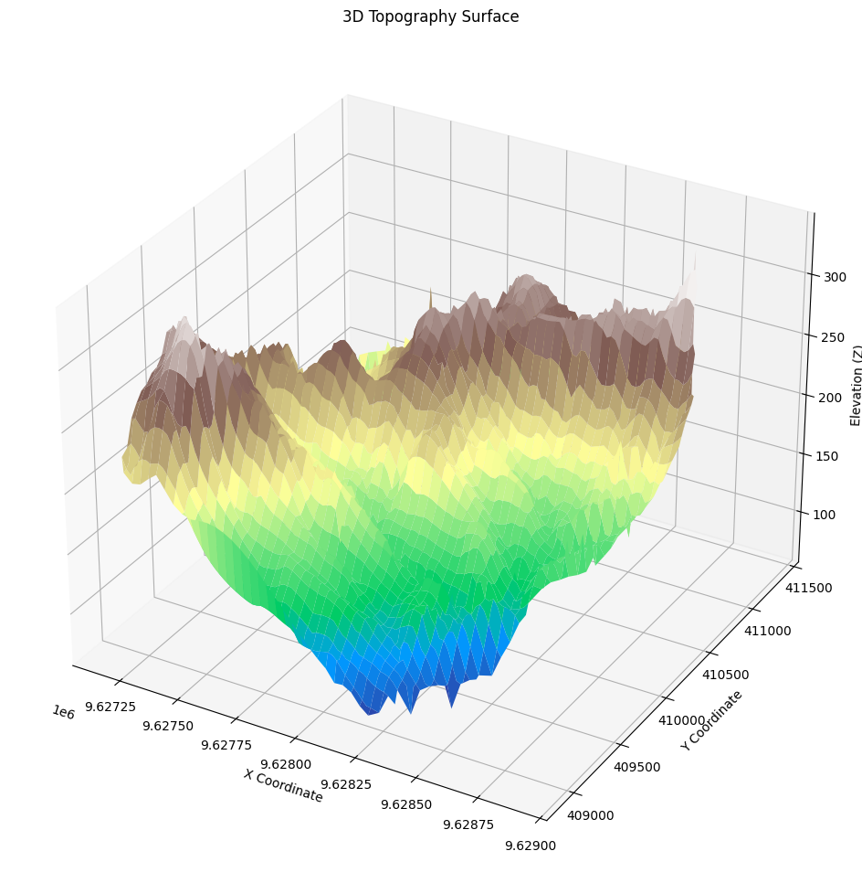
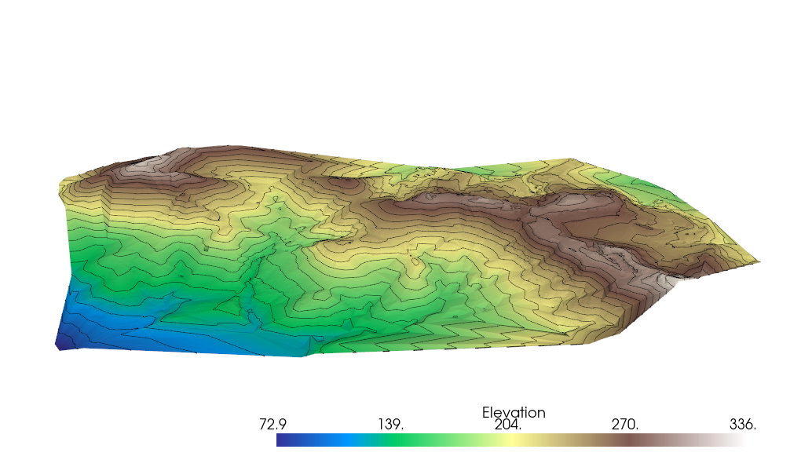

__Modul ini disusun untuk membantu dalam pengolahan data koordinat XYZ serta dapat diekspor kedalam format data GIS yang sering digunakan seperti `.shp` atau `.tiff`, berikut penjelasan yang cukup membingungkan dari salah satu AI yang memiliki akurasi model paling baik saat tulisan ini dibuat.__

_Bayangkan Anda memiliki peta kertas tua yang berisi titik-titik ketinggian di sebuah bukit. Anda ingin mengubahnya menjadi peta 3D yang keren, seperti yang ada di film fiksi ilmiah, dan juga menyimpannya dalam format yang bisa dibaca oleh aplikasi peta modern seperti Google Earth. Sintaks dalam file `topo.ipynb` ini seperti asisten setia Anda: ia membaca data titik-titik ketinggian dari file CSV, membuat visualisasi 3D yang bisa dilihat dari berbagai sudut, dan menyimpan hasilnya dalam bentuk file yang bisa digunakan di perangkat lunak peta profesional. Singkatnya, Sintaks ini membantu Anda "menghidupkan" data topografi menjadi gambar dan file yang berguna!_

---

### **Penjelasan Sintaks Bagian per Bagian**

#### **1. Impor Library yang Dibutuhkan**
**Sintaks:**
```python
import pandas as pd
import numpy as np
import matplotlib.pyplot as plt
from mpl_toolkits.mplot3d import Axes3D
import pyvista as pv
from scipy.interpolate import griddata
import rasterio
from rasterio.transform import from_origin
import geopandas as gpd
from shapely.geometry import LineString
```

**Tujuan:**

__Silahkan dibaca setiap bagian tujuan jika anda bisa memahami tujuan umum pada bagian awal, setiap penjelasan pada modul ini di _generate_ menggunakan AI, jika menurut anda penjelasan tersebut tidak sesuai, silahkan fokus pada blok code dan bagaimana seharusnya luaran dari Sintaks tersebut.__

_Ini seperti mengumpulkan semua alat yang Anda butuhkan sebelum memulai proyek seni. Misalnya, Anda membutuhkan pensil (pandas untuk membaca data), kalkulator (numpy untuk perhitungan), kanvas dan cat (matplotlib dan pyvista untuk menggambar), serta kotak penyimpanan khusus (rasterio dan geopandas untuk menyimpan hasil)._

**Simmiliar Function:**

  - Untuk membaca data: Bayangkan Anda membaca daftar belanja dari kertas biasa (modul `csv`) atau dari spreadsheet Excel (modul `openpyxl`).
  - Untuk interpolasi: Seperti menebak tinggi tanah di antara dua titik yang diketahui dengan kalkulator lain (`scipy.interpolate.interp2d` atau `numpy.interp`).
  - Untuk visualisasi: Seperti menggunakan aplikasi desain interaktif (plotly) atau alat lukis 3D canggih (mayavi, vtk).
  - Untuk menyimpan: Seperti menggunakan kotak arsip lain (fiona, gdal) atau mengedit foto sebelum menyimpan (PIL).

**Output:**

 Tidak ada gambar atau file yang muncul di sini, hanya persiapan alat untuk langkah berikutnya.

---

#### **2. Mengimpor Data (dalam modul ini menggunakan data .CSV)**
**Sintaks:**
```python
data = pd.read_csv('topo_ex3.csv', header=None)
data.columns = ['X', 'Y', 'Z', 'I', 'J']
x = data['X'].values
y = data['Y'].values
z = data['Z'].values
print(data.head())
```

**Tujuan:**

 _Bayangkan Anda membuka buku catatan tua yang penuh dengan titik-titik koordinat X, Y, dan ketinggian Z dari sebuah bukit. Sintaks ini seperti asisten yang membaca buku itu, memberi label pada setiap kolom (X untuk posisi timur-barat, Y untuk utara-selatan, Z untuk ketinggian), dan menyiapkan datanya untuk Anda gunakan lebih lanjut._

**Simmiliar Function:**

  - Anda bisa membaca buku itu secara manual dengan tangan (modul `csv`) atau menggunakan alat sederhana untuk membaca file teks (numpy.loadtxt).

**Metode dan Fungsi lain yang dapat digunakan:**

  ```python
  # Menggunakan numpy.loadtxt
  import numpy as np
  data = np.loadtxt('topo_ex3.csv', delimiter=',')  # Asumsi tidak ada header
  x, y, z = data[:, 0], data[:, 1], data[:, 2]
  print(data[:5])  # Tampilkan 5 baris pertama
  ```
**Output:**

 Anda akan melihat daftar kecil dari data, seperti melihat 5 baris pertama dari buku catatan:
  ```
       X           Y        Z    I   J
  0  9628389.460  410687.142  290.976  NaN NaN
  1  9628491.658  410758.041  299.953  NaN NaN
  2  9628213.287  409755.982  164.825  NaN NaN
  3  9628213.287  409755.982  164.825  NaN NaN
  4  9628756.121  410610.314  230.739  NaN NaN
  ```

---

#### **3. Visualisasi 3D dengan Matplotlib**
**Sintaks:**
```python
x, y, z = data["X"], data["Y"], data["Z"]
grid_x, grid_y = np.meshgrid(
    np.linspace(x.min(), x.max(), 100),
    np.linspace(y.min(), y.max(), 100)
)
grid_z = griddata((x, y), z, (grid_x, grid_y), method="cubic")
fig = plt.figure(figsize=(16, 12))
ax = fig.add_subplot(111, projection="3d")
ax.plot_surface(grid_x, grid_y, grid_z, cmap="terrain", edgecolor="none")
ax.set_xlabel("X Coordinate")
ax.set_ylabel("Y Coordinate")
ax.set_zlabel("Elevation (Z)")
ax.set_title("3D Topography Surface")
plt.show()
```

**Tujuan:**

 Ini seperti menggambar peta 3D sederhana dari bukit Anda di atas kertas. Sintaks ini mengambil titik-titik ketinggian, membuat "jaring" halus di antara titik-titik itu (seperti menarik garis halus di antara titik-titik), lalu menampilkan gambar 3D yang bisa Anda lihat di layar.

**Simmiliar Function:**

  - Anda bisa menggunakan aplikasi interaktif seperti peta digital di ponsel (plotly).
  - Atau alat lukis 3D yang lebih canggih seperti di studio animasi (mayavi).

**Metode dan Fungsi lain yang dapat digunakan:**

  ```python
  # Menggunakan Plotly untuk visualisasi interaktif
  import plotly.graph_objects as go
  fig = go.Figure(data=[go.Surface(z=grid_z, x=grid_x, y=grid_y)])
  fig.update_layout(title='Peta Bukit 3D', scene=dict(xaxis_title='X', yaxis_title='Y', zaxis_title='Ketinggian'))
  fig.show()
  ```
**Output:**

 Anda akan melihat gambar peta 3D statis di layar, seperti lukisan bukit dengan warna yang menunjukkan ketinggian, lengkap dengan label sumbu X, Y, dan Z.



---

#### **4. Visualisasi 3D dengan Pyvista**
**Sintaks:**
```python
points = np.c_[data["X"], data["Y"], data["Z"]]
point_cloud = pv.PolyData(points)
surf = point_cloud.delaunay_2d()
surf["Elevation"] = surf.points[:, 2]
contours = surf.contour(isosurfaces=25)
plotter = pv.Plotter()
plotter.add_mesh(surf, cmap="terrain", show_edges=False)
plotter.add_mesh(contours, color="black", line_width=1.5)
plotter.show()
```

**Tujuan:**

 _Bayangkan Anda membuat model bukit 3D dari plastisin yang bisa Anda putar dan lihat dari semua sudut, lengkap dengan garis-garis ketinggian seperti di peta topografi. Sintaks ini membuat visualisasi interaktif yang lebih hidup dibandingkan Matplotlib._

**Simmiliar Function:**

  - Anda bisa menggunakan alat 3D profesional seperti di studio film (vtk).
  - Atau alat untuk membuat model 3D dari titik-titik (trimesh).

**Metode dan Fungsi lain yang dapat digunakan:**

  ```python
  # Menggunakan VTK (sederhana)
  import vtk
  points = vtk.vtkPoints()
  for i in range(len(x)):
      points.InsertNextPoint(x[i], y[i], z[i])
  polydata = vtk.vtkPolyData()
  polydata.SetPoints(points)
  delaunay = vtk.vtkDelaunay2D()
  delaunay.SetInputData(polydata)
  delaunay.Update()
  # Tambahkan Sintaks visualisasi lebih lanjut untuk menampilkan
  ```
**Output:**

 Jendela interaktif akan muncul, menampilkan bukit 3D yang bisa Anda putar, perbesar, dan lihat garis kontur hitam yang menunjukkan ketinggian.



---

#### **5. Ekspor Kontur ke Shapefile**
**Sintaks:**
```python
contours = surf.contour(isosurfaces=10)
lines = [LineString(contours.points[contours.lines[i+1:i+1+contours.lines[i]]])
         for i in range(0, len(contours.lines), contours.lines[0]+1)]
gdf = gpd.GeoDataFrame(geometry=lines, crs="EPSG:4326")
gdf.to_file("contours.shp")
print("Contours exported as Shapefile: contours.shp")
```

**Tujuan:**

 _Ini seperti mengambil garis-garis ketinggian dari peta Anda dan menyimpannya ke dalam file yang bisa dibuka di aplikasi peta profesional (seperti QGIS). File ini berisi garis-garis kontur yang menunjukkan ketinggian tertentu di bukit Anda._

**Simmiliar Function:**

  - Anda bisa menulis garis-garis itu secara manual ke file seperti menulis di buku (fiona).
  - Atau hanya membuat bentuk garis tanpa menyimpan langsung (shapely).

**Metode dan Fungsi lain yang dapat digunakan:**

  ```python
  # Menggunakan Fiona
  import fiona
  from shapely.geometry import mapping
  schema = {'geometry': 'LineString', 'properties': {}}
  with fiona.open('kontur_manual.shp', 'w', 'ESRI Shapefile', schema, crs='EPSG:4326') as c:
      for line in lines:
          c.write({'geometry': mapping(line), 'properties': {}})
  print("Garis kontur disimpan dengan Fiona")
  ```
**Output:**

 File bernama `contours.shp` akan dibuat di folder Anda, yang bisa dibuka di aplikasi seperti QGIS, dan Anda akan melihat pesan: `Contours exported as Shapefile: contours.shp`.

---

#### **6. Ekspor Surface kedalam file GeoTIFF**
**Sintaks:**
```python
points = surf.points
x, y, z = points[:, 0], points[:, 1], points[:, 2]
grid_size = 100
xi = np.linspace(min(x), max(x), grid_size)
yi = np.linspace(min(y), max(y), grid_size)
X, Y = np.meshgrid(xi, yi)
Z = np.interp(X.ravel(), x, z).reshape(grid_size, grid_size)
transform = from_origin(min(x), max(y), (max(x)-min(x))/grid_size, (max(y)-min(y))/grid_size)
with rasterio.open("topography.tif", "w", driver="GTiff", height=Z.shape[0], width=Z.shape[1],
                   count=1, dtype=Z.dtype, crs="EPSG:4326", transform=transform) as dst:
    dst.write(Z, 1)
print("Surface exported as GeoTIFF: topography.tif")
```

**Tujuan:**

 _Bayangkan Anda mengambil foto udara dari bukit Anda dan menyimpannya dalam format gambar khusus yang bisa dibaca oleh aplikasi peta. Sintaks ini membuat file gambar yang menunjukkan ketinggian di setiap titik di bukit Anda._

**Simmiliar Function:**

  - Anda bisa menggunakan alat khusus untuk membuat gambar peta (gdal).
  - Atau mengedit gambar terlebih dahulu seperti di aplikasi foto (PIL).

**Metode dan Fungsi lain yang dapat digunakan:**

  ```python
  # Menggunakan GDAL
  from osgeo import gdal
  driver = gdal.GetDriverByName('GTiff')
  dataset = driver.Create('foto_bukit.tif', 100, 100, 1, gdal.GDT_Float32)
  dataset.SetGeoTransform((min(x), (max(x)-min(x))/100, 0, max(y), 0, -(max(y)-min(y))/100))
  dataset.SetProjection('EPSG:4326')
  dataset.GetRasterBand(1).WriteArray(Z)
  dataset.FlushCache()
  print("Foto bukit disimpan dengan GDAL")
  ```
**Output:**

 File bernama `topography.tif` akan dibuat, yang bisa dibuka di aplikasi seperti QGIS untuk melihat peta ketinggian, dan Anda akan melihat pesan: `Surface exported as GeoTIFF: topography.tif`.

---

### **Kesimpulan**
Modul ini seperti panduan untuk mengubah catatan ketinggian bukit Anda menjadi peta 3D yang menarik. Anda bisa melihatnya sebagai gambar sederhana `(Matplotlib)`, model interaktif `(Pyvista)`, atau menyimpannya sebagai file peta `(Shapefile dan GeoTIFF)` untuk digunakan di aplikasi profesional. Dengan Simmiliar Function, Anda bisa menyesuaikan cara membaca data, menggambar, atau menyimpan sesuai kebutuhan Anda. Semoga cerita dan analogi ini membantu Anda memahami Sintaks dengan lebih mudah dan menyenangkan! Jika ada yang ingin diperjelas lagi, silakan beri tahu saya.

## File Jupyter Notebook (.ipynb) dan data yang digunakan pada modul ini dapat diakses pada Link dibawah:

[Data dalam format.csv](https://lynk.id/kenalibumi)